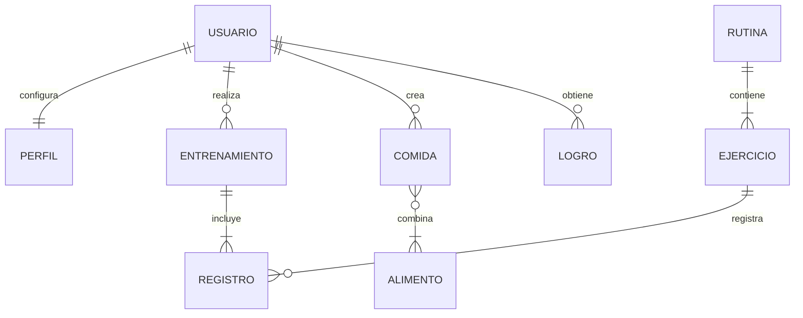
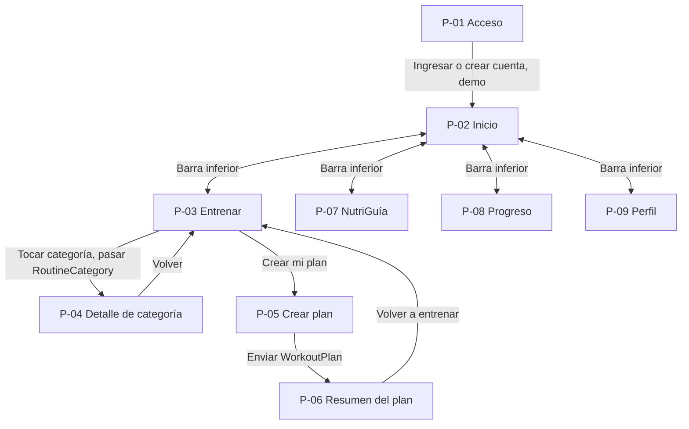
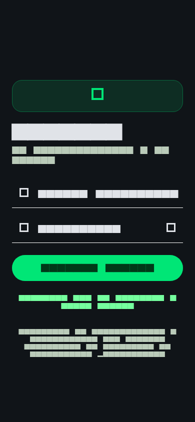
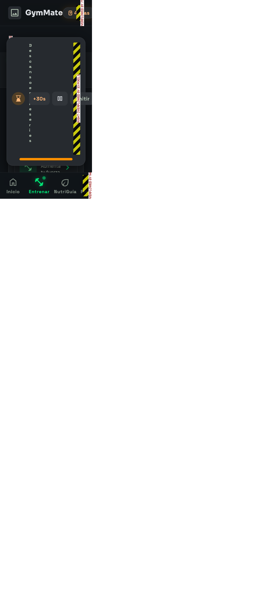
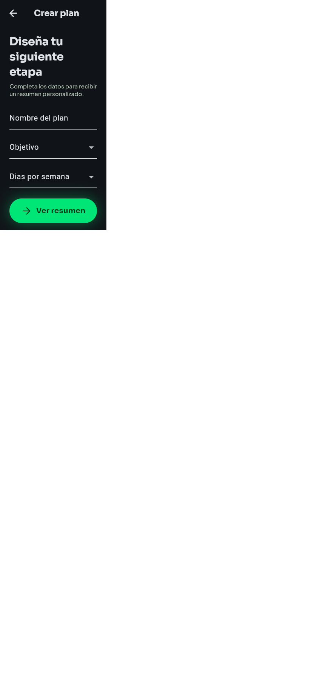
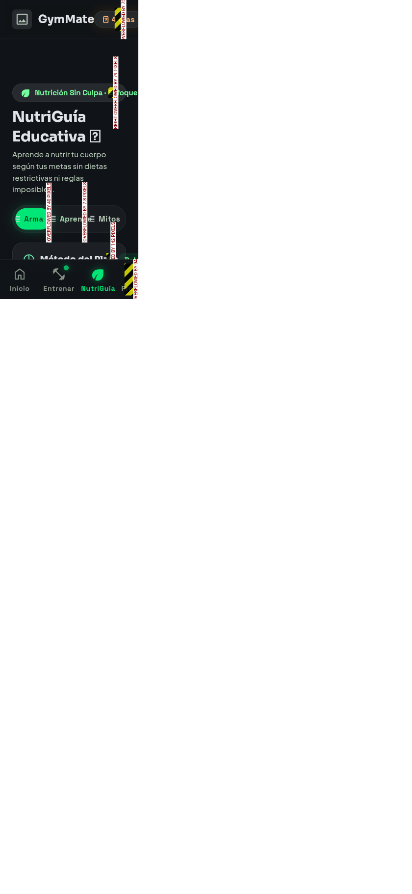
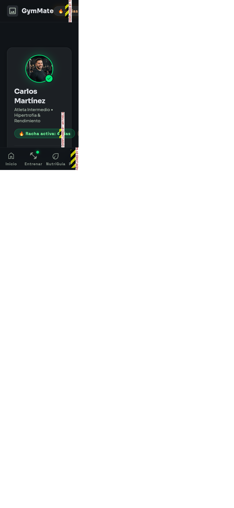

# GymMate

| Ficha | Información |
|---|---|
| Integrantes | Vanessa Ospina, Salome Caicedo |
| Curso y grupo | Programación Móvil (IF2004), grupo 601 |
| Fecha | 25 de septiembre de 2026 |
| Versión | 1.0 |

## Tabla de contenido

1. [Descripción general](#1-descripción-general)
2. [Problema](#2-problema)
3. [Objetivos](#3-objetivos)
4. [Stakeholders, actores y roles](#4-stakeholders-actores-y-roles)
5. [Alcance](#5-alcance)
6. [Funcionalidades](#6-funcionalidades)
7. [Requerimientos funcionales](#7-requerimientos-funcionales)
8. [Requerimientos no funcionales](#8-requerimientos-no-funcionales)
9. [Reglas de negocio](#9-reglas-de-negocio)
10. [Modelo de datos](#10-modelo-de-datos)
11. [Pantallas y mapa de navegación](#11-pantallas-y-mapa-de-navegación)
12. [Mockup](#12-mockup)
13. [Historias, casos de uso, restricciones y supuestos](#13-historias-casos-de-uso-restricciones-y-supuestos)
14. [Arquitectura técnica y navegación implementada](#14-arquitectura-técnica-y-navegación-implementada)

## 1. Descripción general

GymMate es una aplicación móvil de acompañamiento para organizar rutinas, consultar ejercicios, registrar sesiones y revisar el progreso. También ofrece NutriGuía, un espacio educativo con conceptos básicos de alimentación e ideas para combinar alimentos. Está dirigida a personas principiantes e intermedias; la información no reemplaza la orientación de profesionales de entrenamiento, nutrición o salud.

## 2. Problema

Quienes empiezan a entrenar suelen tener dificultades para elegir ejercicios, organizar series y descansos y llevar un registro que permita reconocer sus avances. También encuentran información contradictoria sobre alimentación. GymMate reúne orientación general y seguimiento en el teléfono, disponible durante la sesión de entrenamiento y sin depender de una hoja de cálculo o de consultar varias fuentes. El proyecto no cuenta todavía con una medición de campo de la frecuencia de estos problemas; se validará con pruebas de usuario.

## 3. Objetivos

### 3.1 Objetivo general

Desarrollar una aplicación móvil que permita organizar y realizar entrenamientos, consultar el progreso y aprender conceptos básicos sobre alimentación.

### 3.2 Objetivos específicos

- Al menos el 80 % de participantes de una prueba podrá iniciar una rutina sin ayuda.
- Al menos el 80 % de participantes registrará correctamente una serie en una sesión de prueba.
- Una persona podrá encontrar un ejercicio en menos de 30 segundos usando la lista disponible.
- Al menos el 80 % de participantes identificará cómo construir una comida desde NutriGuía.
- Las personas podrán reconocer en Progreso su historial y al menos una estadística de entrenamiento.

## 4. Stakeholders, actores y roles

| Interesado o rol | Interés y permisos |
|---|---|
| Usuario (rol de la app) | Se registra, inicia sesión, configura su perfil, consulta rutinas y contenidos, registra sus sesiones y revisa sus propios datos. |
| Entrenadores (stakeholder) | Pueden aportar retroalimentación; no tienen un rol operativo en el MVP. |
| Profesionales de nutrición (stakeholder) | Pueden revisar el enfoque educativo; no prescriben dietas desde la app. |
| Equipo desarrollador | Diseña, implementa, prueba y mantiene la aplicación. |
| Universidad y docentes | Evalúan el proyecto académico y su sustentación. |

El MVP contempla un único rol de aplicación: Usuario. El login permite alternar entre iniciar sesión y crear cuenta; en este entregable la entrada es demostrativa y no autentica contra un servidor.

## 5. Alcance

### 5.1 Incluye

- Registro/inicio de sesión y configuración básica de perfil.
- Rutinas, ejercicios, indicaciones y alternativas por equipo.
- Sesión de entrenamiento con series, repeticiones, peso y temporizador.
- Historial, métricas básicas y logros de constancia.
- NutriGuía: aprendizaje, grupos de alimentos, armado de plato, ideas y mitos.
- Navegación entre Inicio, Entrenar, NutriGuía, Progreso y Perfil.

### 5.2 No incluye

Diagnóstico ni tratamiento médico o nutricional; dietas personalizadas; consultas, chat o red social; compra y pagos; clases en vivo; integración con dispositivos; análisis corporal por cámara; ni recomendaciones avanzadas de inteligencia artificial.

## 6. Funcionalidades

| ID | Rol | Funcionalidad |
|---|---|---|
| F-01 | Usuario | Crear cuenta, iniciar sesión y editar información básica del perfil. |
| F-02 | Usuario | Consultar rutinas y abrir su detalle. |
| F-03 | Usuario | Crear un plan indicando nombre, objetivo y frecuencia semanal. |
| F-04 | Usuario | Iniciar una sesión, registrar series y usar el temporizador de descanso. |
| F-05 | Usuario | Consultar historial, estadísticas y logros. |
| F-06 | Usuario | Consultar contenido educativo y construir una idea de comida en NutriGuía. |

## 7. Requerimientos funcionales

| ID | Requerimiento | Rol | Prioridad |
|---|---|---|---|
| RF-01 | La app debe permitir crear una cuenta e iniciar sesión con correo y contraseña. | Usuario | Alta |
| RF-02 | La app debe permitir consultar y actualizar nivel, objetivos y preferencias del perfil. | Usuario | Media |
| RF-03 | La app debe mostrar rutinas y el detalle de la categoría seleccionada. | Usuario | Alta |
| RF-04 | La app debe permitir crear un plan con nombre de al menos 3 caracteres, un objetivo y una frecuencia de 2 a 5 días por semana. | Usuario | Alta |
| RF-05 | La app debe permitir registrar series, repeticiones y peso durante una sesión. | Usuario | Alta |
| RF-06 | La app debe mostrar temporizador de sesión y permitir controlar el descanso entre series. | Usuario | Media |
| RF-07 | La app debe presentar historial, estadísticas básicas y logros de entrenamiento. | Usuario | Media |
| RF-08 | La app debe presentar contenidos educativos de alimentación y permitir seleccionar alimentos para armar un plato. | Usuario | Alta |

## 8. Requerimientos no funcionales

| ID | Categoría | Requerimiento verificable |
|---|---|---|
| RNF-01 | Plataforma | La aplicación debe compilar y ejecutarse con Flutter en las plataformas configuradas en el repositorio. |
| RNF-02 | Usabilidad | El formulario de plan debe impedir continuar mientras falte nombre, objetivo o frecuencia, e indicar el campo por corregir. |
| RNF-03 | Navegación | Toda pantalla secundaria debe permitir volver a su pantalla anterior con la navegación del sistema o una acción visible. |
| RNF-04 | Privacidad | La información de perfil y entrenamiento debe pertenecer al usuario autenticado; la autenticación y el almacenamiento persistente quedan pendientes de una fase posterior. |
| RNF-05 | Educación | NutriGuía debe identificar sus contenidos como educativos y no médicos. |
| RNF-06 | Mantenibilidad | Cada pantalla y modelo debe permanecer organizado en los directorios de `lib/` correspondientes. |

## 9. Reglas de negocio

| ID | Regla |
|---|---|
| RN-01 | Para usar las funciones principales, la persona debe iniciar sesión y completar un perfil básico. |
| RN-02 | Una rutina debe contener al menos un ejercicio. |
| RN-03 | Todo entrenamiento y registro pertenece a un único usuario. |
| RN-04 | El usuario solo puede modificar sus propios registros. |
| RN-05 | Un entrenamiento finalizado se conserva en el historial. |
| RN-06 | Una alternativa de ejercicio debe considerar el equipo disponible. |
| RN-07 | Los contenidos de NutriGuía son generales y no constituyen diagnóstico, tratamiento ni prescripción. |
| RN-08 | Una comida puede combinar alimentos de distintos grupos seleccionados por el usuario. |

## 10. Modelo de datos

El MVP prevé conservar Usuario, Perfil, Entrenamiento, Registro, Comida y Logro en almacenamiento local persistente para que sobrevivan al cierre de la app. Rutinas, ejercicios y alimentos iniciales serán contenido local de solo lectura. La persistencia aún no está implementada en este entregable de navegación.

| Entidad | Atributos principales | Relaciones | Almacenamiento previsto |
|---|---|---|
| Usuario | id, nombre, correo | Tiene un perfil, entrenamientos y logros. | Local persistente, previsto; pendiente implementar. |
| Perfil | usuarioId, nivel, objetivos, preferencias | Pertenece a un usuario. | Local persistente, previsto; pendiente implementar. |
| Rutina | id, nombre, descripción | Agrupa ejercicios. | Datos locales de solo lectura en `lib/data/mock_data.dart`. |
| Ejercicio | id, nombre, grupoMuscular, equipo, instrucciones | Puede estar en varias rutinas y tener alternativas. | Datos locales de solo lectura en `lib/data/mock_data.dart`. |
| Entrenamiento | id, usuarioId, rutinaId, fecha, duración, estado | Pertenece al usuario y contiene registros. | Local persistente, previsto; pendiente implementar. |
| Registro | id, entrenamientoId, ejercicioId, series, repeticiones, peso, descanso | Pertenece a un entrenamiento y un ejercicio. | Local persistente, previsto; pendiente implementar. |
| Alimento | id, nombre, grupo | Puede incluirse en una comida. | Datos locales de solo lectura en `lib/data/mock_data.dart`. |
| Comida | id, usuarioId, alimentos | Pertenece a un usuario y combina alimentos. | Local persistente, previsto; pendiente implementar. |
| Logro | id, usuarioId, nombre, condición, fecha | Se asigna al cumplir una condición. | Local persistente, previsto; pendiente implementar. |

## 11. Pantallas y mapa de navegación

| ID | Pantalla | Archivo | Propósito y requerimientos |
|---|---|---|---|
| P-01 | Acceso / crear cuenta | `lib/screens/login_screen.dart` | Formulario de acceso y registro demostrativo; RF-01. |
| P-02 | Inicio | `lib/screens/inicio_screen.dart` | Resumen y accesos principales; F-01, F-06. |
| P-03 | Entrenar | `lib/screens/entrenar_screen.dart` | Rutinas, sesión activa, series y descanso; RF-03, RF-05, RF-06. |
| P-04 | Detalle de categoría | `lib/screens/category_detail_screen.dart` | Muestra la categoría seleccionada; recibe `RoutineCategory`; RF-03. |
| P-05 | Crear plan | `lib/screens/plan_form_screen.dart` | Captura y valida nombre, objetivo y frecuencia; RF-04. |
| P-06 | Resumen del plan | `lib/screens/plan_summary_screen.dart` | Muestra el `WorkoutPlan` enviado por el formulario; RF-04. |
| P-07 | NutriGuía | `lib/screens/nutriguia_screen.dart` | Aprendizaje, plato y mitos; RF-08. |
| P-08 | Progreso | `lib/screens/progreso_screen.dart` | Historial, estadísticas y logros; RF-07. |
| P-09 | Perfil | `lib/screens/perfil_screen.dart` | Datos y preferencias del usuario; RF-02. |

## 12. Mockup

Las imágenes de `docs/mockup/` corresponden a capturas del prototipo Flutter actual y sirven como mockup de baja fidelidad; se actualizarán si cambia la interfaz. Cada imagen conserva el ID de la pantalla de la sección 11.

| Pantalla | Imagen | Descripción |
|---|---|---|
| P-01 Acceso |  | Marca, correo, contraseña y acción de acceso/registro. |
| P-02 Inicio |  | Resumen personal, racha, rutina y accesos de GymMate. |
| P-03 Entrenar |  | Sesión activa, rutina y control de series/descanso. |
| P-04 Detalle de categoría |  | Detalle de la categoría seleccionada desde Entrenar. |
| P-05 Crear plan |  | Formulario de nombre, objetivo y frecuencia. |
| P-06 Resumen del plan |  | Objetivo y frecuencia recibidos del formulario. |
| P-07 NutriGuía |  | Herramienta para armar un plato y contenidos educativos. |
| P-08 Progreso |  | Métricas, evolución e historial de entrenamiento. |
| P-09 Perfil |  | Perfil, rutina activa y preferencias. |

## 13. Historias, casos de uso, restricciones y supuestos

| ID | Historia de usuario |
|---|---|
| HU-01 | Como usuario nuevo, quiero crear una cuenta para tener un perfil personal. |
| HU-02 | Como usuario, quiero elegir mis objetivos y nivel para orientar mi experiencia. |
| HU-03 | Como usuario, quiero consultar una rutina y su categoría para saber qué entrenar. |
| HU-04 | Como usuario, quiero crear un plan con frecuencia y objetivo para organizar mi semana. |
| HU-05 | Como usuario, quiero registrar series y descansos para conservar el resultado de mi sesión. |
| HU-06 | Como usuario, quiero revisar mi progreso para reconocer mi evolución. |
| HU-07 | Como usuario, quiero aprender sobre alimentos y combinarlos para construir ideas de comidas. |

### 13.1 Caso de uso: crear un plan

| Elemento | Descripción |
|---|---|
| Actor | Usuario con la app abierta. |
| Precondición | Se encuentra en Entrenar. |
| Flujo principal | Abre Crear mi plan, escribe un nombre, elige objetivo y frecuencia, y toca Ver resumen. La app valida el formulario, construye un `WorkoutPlan` y abre el resumen. |
| Excepción | Si falta un dato o el nombre tiene menos de 3 caracteres, el formulario señala el error y permanece abierto. |
| Resultado | P-06 presenta el plan recibido y permite volver a Entrenar. |

### 13.2 Restricciones y supuestos

- La app se desarrolla en Flutter para el proyecto académico y el tiempo disponible es de 3 a 4 meses.
- El contenido inicial de rutinas, ejercicios y alimentos es de demostración.
- El login actual no verifica credenciales; se incorporará autenticación al implementar el almacenamiento.
- La persistencia local y la gestión segura de credenciales quedan fuera del prototipo de navegación actual.
- El usuario dispone de un dispositivo compatible; algunas imágenes de demostración requieren conexión.

## 14. Arquitectura técnica y navegación implementada

### 14.1 Entorno y organización

Entorno verificado: Flutter 3.47.0 stable y Dart 3.13.0; el constraint del proyecto es `sdk: ^3.13.0`. Versiones resueltas en `pubspec.lock`:

| Paquete | Versión | Uso |
|---|---|---|
| `material_symbols_icons` | 4.2960.0 | Iconos Material Symbols usados por las pantallas y controles. |
| `google_fonts` | 8.2.1 | Tipografía Sora, Plus Jakarta Sans y Space Grotesk definida en `lib/theme/app_text.dart`. |
| `cupertino_icons` | 1.0.9 | Dependencia de la plantilla Flutter; no se usa directamente en las pantallas actuales. |

Flutter provee Material y `Navigator`, por lo que el proyecto no usa un paquete de navegación adicional. La implementación mantiene widgets y modelos sencillos en las carpetas existentes, sin afirmar una arquitectura por capas todavía no creada.

| Carpeta | Responsabilidad actual |
|---|---|
| `lib/screens/` | Vistas principales y pantallas secundarias. |
| `lib/widgets/` | Componentes reutilizables y navegación inferior. |
| `lib/models/` | Modelos de rutina, ejercicio y entidades de vista. |
| `lib/data/` | Datos de demostración. |
| `lib/theme/` | Colores y estilos tipográficos. |

### 14.2 Rutas implementadas

| Pantalla | Archivo | Se llega desde | Dato recibido |
|---|---|---|---|
| P-01 Acceso | `lib/screens/login_screen.dart` | Inicio de la aplicación | Ninguno; credenciales demostrativas. |
| P-02 Inicio | `lib/screens/inicio_screen.dart` | P-01, al enviar el formulario válido | Ninguno. |
| P-03 Entrenar | `lib/screens/entrenar_screen.dart` | Barra inferior de AppShell | `onTabSelected`. |
| P-04 Detalle de categoría | `lib/screens/category_detail_screen.dart` | P-03, mediante `Navigator.push` | `RoutineCategory` de la categoría tocada. |
| P-05 Crear plan | `lib/screens/plan_form_screen.dart` | P-03, mediante `Navigator.push` | Ninguno. |
| P-06 Resumen del plan | `lib/screens/plan_summary_screen.dart` | P-05, mediante `Navigator.push` | `WorkoutPlan` construido y validado. |
| P-07 NutriGuía | `lib/screens/nutriguia_screen.dart` | Barra inferior de AppShell | Ninguno. |
| P-08 Progreso | `lib/screens/progreso_screen.dart` | Barra inferior de AppShell | Ninguno. |
| P-09 Perfil | `lib/screens/perfil_screen.dart` | Barra inferior de AppShell | Racha desde AppShell. |

Cada vista principal tiene su propio `Scaffold`; `AppShell` conserva el encabezado y la navegación inferior compartidos. Las pestañas usan selección de tab y los flujos secundarios usan `Navigator.push/pop`. La app utiliza datos de demostración en memoria. El guardado persistente se implementará posteriormente para cumplir la conservación entre aperturas descrita en RNF-04 y el modelo de datos.

## Historial de cambios

| Fecha | Cambio | Responsable |
|---|---|---|
| 25-09-2026 | Definición formal del entregable 1 y correspondencia inicial con el prototipo. | Equipo GymMate |

## Referencias

| Fuente | Uso en el documento |
|---|---|
| [Actividad: definición del proyecto y navegación](https://oscarleosanchez.github.io/sitio-iue-2026-02/movil/proyecto-entregable-1/actividad/) | Estructura, condiciones mínimas y alcance del entregable 1. |
| [Flutter: Navigation and routing](https://docs.flutter.dev/ui/navigation) | Navegación entre pantallas con Navigator. |
| [Flutter: Form validation](https://docs.flutter.dev/cookbook/forms/validation) | Validación del formulario del plan. |

## Declaración de uso de inteligencia artificial

Se utilizó GitHub Copilot para contrastar este repositorio con la consigna enlazada, proponer la estructura de este documento y añadir un formulario demostrativo de acceso consistente con la interfaz existente. El equipo debe revisar y confirmar los requisitos, objetivos, reglas, alcance y mockups antes de entregar; la herramienta no verificó los datos de las personas usuarias ni sustituyó decisiones del equipo. La autenticación real y la persistencia no se declaran implementadas.